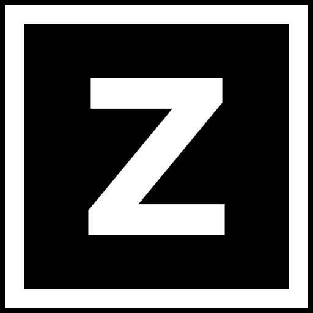
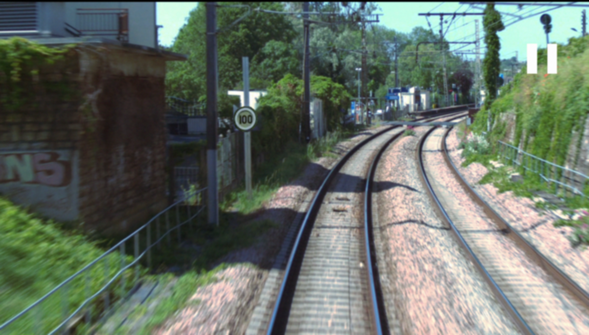
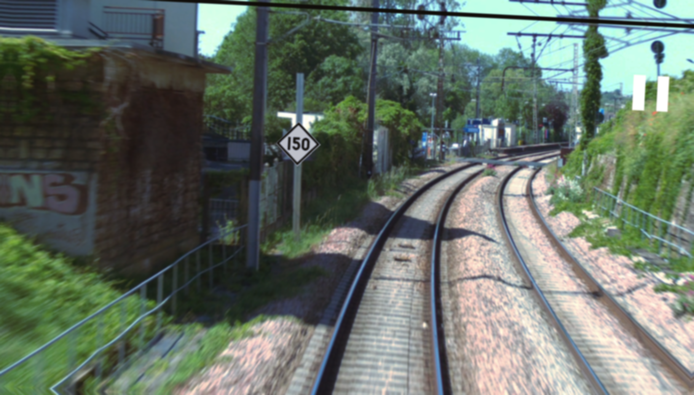
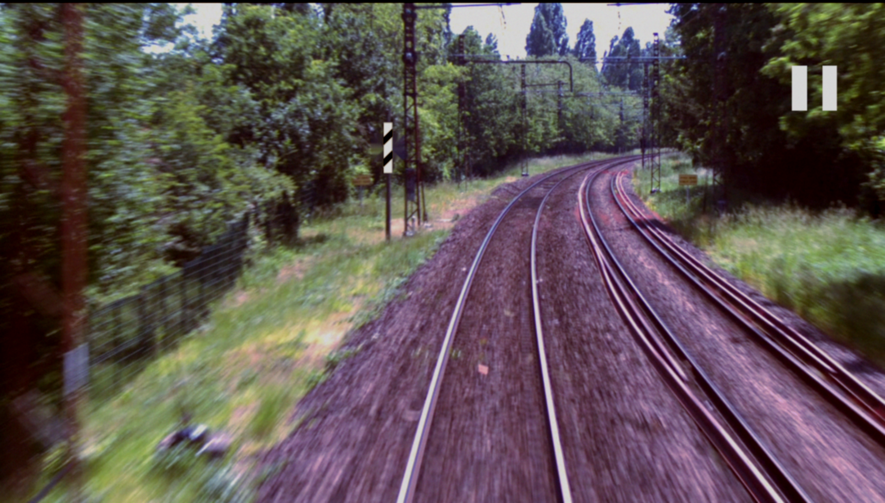

  <h1> Synthetic Data for Object Detection </h1>

This repository contains a simple way to create french railway signs images and generate their label files in YOLO annotation format in order to train an object detection model. This could be used in any other field outside of railway signs.

Many of the railway signs templates used (including in this readme) are taken from the following repository: https://github.com/nicolaswurtz/signalisation-rfn-svg

## Overview:
The algorithm relies on python's albumnetations and OpenCv.
The idea is to take a background image, which is an already annotated image with only one sign, and put the new sign in the same position of the old sign based on its label file. 
Some transformations are applied to the sign image to make them more realistic and generate different instances.
Some other transformation are applied to the background images to try to remove the old sign. 
And finally some transformations are applied to the final image to simulate different weather conditions and the deformations due to the train speed.

**Examples of signs templates:** 
(Those are PNG vector images but one can use real life sign images cropped from their context, provided that the sign is clear enough.)

  
  
  
  
  

**Examples of outputs:**

  
  
  
  

